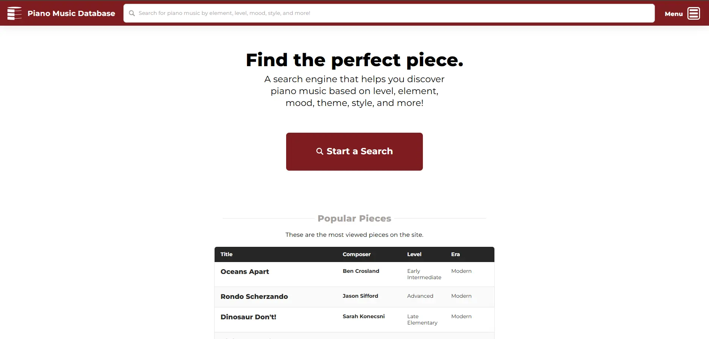
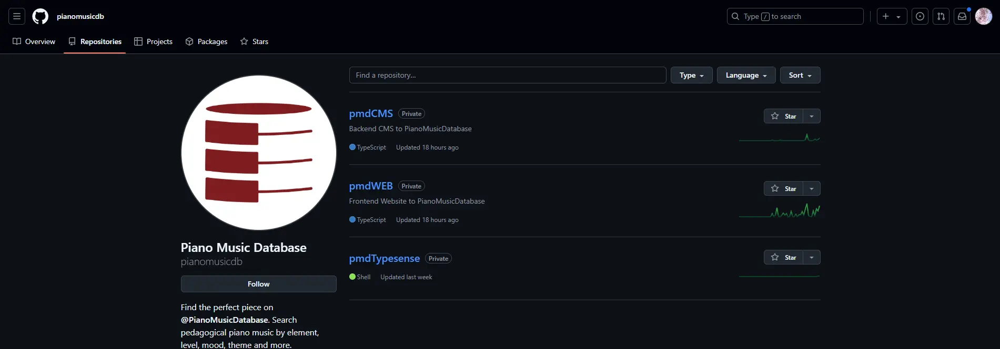
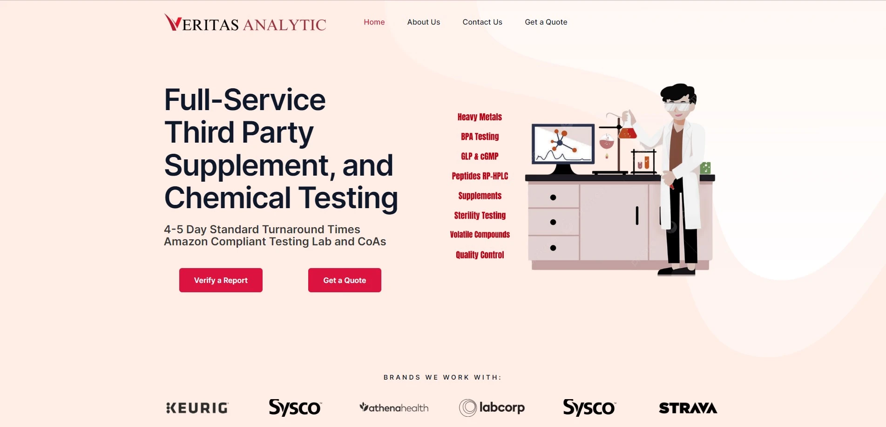

# my-private-works
This repository is for showing my private works. I can only shows the images of previous works since I worked under NDA.

## 1. Piano Music Database
Piano Music Database is an innovative online platform that serves as a comprehensive search engine and repository for
pedagogical piano repertoire, meticulously categorized by various attributes such as level, mood, and style, designed to
assist piano teachers in finding the perfect pieces for their students.

[Visit Website](https://pianomusicdatabase.com)

🔹 **Tech Stack**: Next.js, Strapi, Typesense, AWS, GitHub Actions

## 2. Flyconcierge
Fly Concierge offers exclusive access to significant savings of up to 70% on premium first and business class flights,
combined with personalized concierge services to ensure a luxurious and hassle-free travel experience.

[Visit Website](https://flyconcierge.vip/)

🔹 **Tech Stack**: Wordpress, Theme Customization, Hostinger VPS

## 3. Bronx Aerogel
Bronx Aerogel is a pioneering leader in thermal insulation technology, committed to sustainability and innovation,
providing cutting-edge aerogel solutions that enhance energy efficiency and reduce environmental impact.

[Visit Website](https://bronxaerogel.com)

🔹 **Tech Stack**: Next.js, Cloudflare Turnstile, Digital Ocean Loadbalancer, Droplet, Azure App Service

## 4. Piano Music Database
Veritas Analytic specializes in providing accurate and reliable laboratory testing services across various industries,
empowering clients to achieve the highest standards of quality and compliance.

[Visit Website](https://veritasanalytic.com)

🔹 **Tech Stack**: Wordpress, Theme Customization, Secure file serving

---